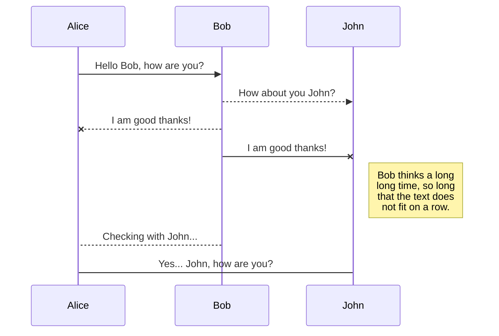
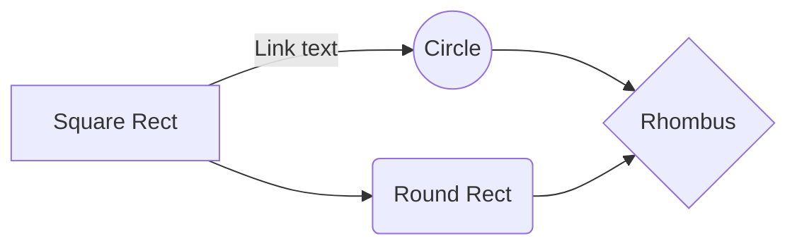

https://docs.google.com/forms/d/1uoUeZNKSXIeKx9c8seaA5VYIKzpwjhWXilgovIvwZgo/viewanalytics


# use-dark-mode 

A custom [React Hook](https://reactjs.org/docs/hooks-overview.html) to help you implement a "dark mode" component for your application.
The user setting persists to `localStorage`.

❤️ it? ⭐️ it on [GitHub](https://github.com/donavon/use-dark-mode/stargazers)
or [Tweet](https://twitter.com/intent/tweet?text=Check%20out%20the%20useDarkMode%20custom%20React%20Hook%20that%20simplifies%20adding%20a%20persistent%20dark%20mode%20setting%20to%20your%20app.&url=https%3A%2F%2Fgithub.com%2Fdonavon%2Fuse-dark-mode&via=donavon&hashtags=reactjs,hooks,darkmode)
about it.

[](https://badge.fury.io/js/use-dark-mode) [](https://travis-ci.com/donavon/use-dark-mode) [](#contributors)
[](https://twitter.com/intent/tweet?text=Check%20out%20the%20useDarkMode%20custom%20React%20Hook%20that%20simplifies%20adding%20a%20persistent%20dark%20mode%20setting%20to%20your%20app.&url=https%3A%2F%2Fgithub.com%2Fdonavon%2Fuse-dark-mode&via=donavon&hashtags=reactjs,hooks,darkmode)


`useDarkMode` works in one of two ways:

1.  By toggling a CSS class on whatever element you specify (defaults to `document.body`).
    You then setup your CSS to display different views based on the presence of the selector. For example, the following CSS is used in the demo app to ease the background color in/out of dark mode.

    ```css
    body.light-mode {
      background-color: #fff;
      color: #333;
      transition: background-color 0.3s ease;
    }
    body.dark-mode {
      background-color: #1a1919;
      color: #999;
    }
    ```

2.  If you don't use global classes, you can specify an `onChange` handler and take care of the implementation of switching to dark mode yourself.

## New in Version 2.x

- `useDarkMode` now persists between sessions. It stores the user setting in
  `localStorage`.

- It shares dark mode state with all other `useDarkMode` components on the page.

- It shares dark mode state with all other tabs/browser windows.

- The initial dark mode is queried from the system. Note: this requires a browser that supports the `prefers-color-scheme: dark` media query
  ([currently Chrome, Firefox, Safari and Edge](https://caniuse.com/#search=prefers-color-scheme))
  and a system that supports dark mode, such as macOS Mojave.

- Changing the system dark mode state will also change the state of `useDarkMode`
  (i.e, change to light mode in the system will change to light mode in your app).

- Support for Server Side Rendering (SSR) in version 2.2 and above.

## Requirement

To use `use-dark-mode`, you must use `react@16.8.0` or greater which includes Hooks.

## Installation

```sh
$ npm i use-dark-mode
```

## Usage

```js
const darkMode = useDarkMode(initialState, darkModeConfig);
```

### Parameters

You pass `useDarkMode` an `initialState` (a boolean specifying whether it should be in dark mode
by default) and an optional `darkModeConfig` object. The configuration object may contain the following keys.

| Key               | Description                                                                                                                                                                                                                                                                                                               |
| :---------------- | :------------------------------------------------------------------------------------------------------------------------------------------------------------------------------------------------------------------------------------------------------------------------------------------------------------------------ |
| `classNameDark`   | The class to apply. Default = `dark-mode`.                                                                                                                                                                                                                                                                                |
| `classNameLight`  | The class to apply. Default = `light-mode`.                                                                                                                                                                                                                                                                               |
| `element`         | The element to apply the class name. Default = `document.body`.                                                                                                                                                                                                                                                           |
| `onChange`        | A function that will be called when the dark mode value changes and it is safe to access the DOM (i.e. it is called from within a `useEffect`). If you specify `onChange` then `classNameDark`, `classNameLight`, and `element` are ignored (i.e. no classes are automatically placed on the DOM). You have full control! |
| `storageKey`      | A string that will be used by the `storageProvider` to persist the dark mode value. If you specify a value of `null`, nothing will be persisted. Default = `darkMode`.                                                                                                                                                                                                                   |
| `storageProvider` | A storage provider. Default = `localStorage`. You will generally never need to change this value.                                                                                                                                                                                                                       |

### Return object

A `darkMode` object is returned with the following properties.

| Key         | Description                                             |
| :---------- | :------------------------------------------------------ |
| `value`     | A boolean containing the current state of dark mode.    |
| `enable()`  | A function that allows you to set dark mode to `true`.  |
| `disable()` | A function that allows you to set dark mode to `false`. |
| `toggle()`  | A function that allows you to toggle dark mode.         |

Note that because the methods don't require any parameters, you can call them
direcly from an `onClick` handler from a button, for example
(i.e., no lambda function is required).

## Example

Here is a simple component that uses `useDarkMode` to provide a dark mode toggle control.
If dark mode is selected, the CSS class `dark-mode` is applied to `document.body` and is removed
when de-selected.

```jsx
import React from 'react';
import useDarkMode from 'use-dark-mode';

import Toggle from './Toggle';

const DarkModeToggle = () => {
  const darkMode = useDarkMode(false);

  return (
    <div>
      <button type="button" onClick={darkMode.disable}>
        ☀
      </button>
      <Toggle checked={darkMode.value} onChange={darkMode.toggle} />
      <button type="button" onClick={darkMode.enable}>
        ☾
      </button>
    </div>
  );
};

export default DarkModeToggle;
```

## That flash!

If your CSS is setup to default to light mode, but the user selects dark mode,
the next time they visit your app, they will be in dark mode.
However, the user will see a flash of light mode before the app is spun up
and `useDarkMode` is called.

To prevent this, I've included some vanilla JavaScript that you can insert in your
`index.html` just after the `<body>` tag. It is in a file named [noflash.js.txt](https://github.com/donavon/use-dark-mode/blob/develop/noflash.js.txt).
You can either insert the contents of this file in a `<script>` tag or automate the
step in your build process.

Note that if you change any of the default—such as `storageKey` or `classNameDark` for example—the `noflash.js` file will need to be modified with the same values.

### Gatsby

Gatsby users may leverage [`gatsby-plugin-use-dark-mode`](https://github.com/wKovacs64/gatsby-plugin-use-dark-mode#readme) to inject `noflash.js` for you.

### Next.js

For next.js uses copy the `noflash.js.txt` to your `public` folder (`public/noflash.js`) and then create a `_document.js` and include the script **before** `<Main />`.

```js
import Document, { Html, Head, Main, NextScript } from 'next/document';

class MyDocument extends Document {
  render() {
    return (
      <Html>
        <Head />
        <body>
          <script src="noflash.js" />
          <Main />
          <NextScript />
        </body>
      </Html>
    );
  }
}

export default MyDocument;
```

## Sample Apps

Here is a list of apps build with `use-dark-mode`.
If you have an app you would like to include on this list, open a PR.

* [Demo App on CodeSandbox](https://codesandbox.io/s/mzj64x80ny) - by [@donavon](https://twitter.com/donavon)

## License

**[MIT](LICENSE)** Licensed

##  Programadores

<table>

<tr>

<td align="center"><a href="http://donavon.com"><br /><sub><b>Yullano Santos</b></sub></a><br /><a> Engenharia de Software </a></td>

<td align="center"><a href="https://github.com/revelcw"><br /><sub><b>Odival Quaresma</b></sub></a><br /><a href="#ideas-revelcw" title="Ideas, Planning, & Feedback">Engenharia de Software </a></td>

<td align="center"><a href="https://github.com/Andarist"><br /><sub><b>Diego Teixeira</b></sub></a><br /><a href="https://github.com/donavon/use-dark-mode/commits?author=Andarist" title="Code">Engenharia de Software </a></td>

<td align="center"><a href="https://github.com/wKovacs64"><br /><sub><b>Jailson Soares</b></sub>Engenharia de Software </a><br />
</a></td>
</tr>
</table>

This project follows the [all-contributors](https://github.com/all-contributors/all-contributors) specification. Contributions of any kind welcome!


# Welcome to StackEdit!

Hi! I'm your first Markdown file in **StackEdit**. If you want to learn about StackEdit, you can read me. If you want to play with Markdown, you can edit me. Once you have finished with me, you can create new files by opening the **file explorer** on the left corner of the navigation bar.


# Files

StackEdit stores your files in your browser, which means all your files are automatically saved locally and are accessible **offline!**

## Create files and folders

The file explorer is accessible using the button in left corner of the navigation bar. You can create a new file by clicking the **New file** button in the file explorer. You can also create folders by clicking the **New folder** button.

## Switch to another file

All your files and folders are presented as a tree in the file explorer. You can switch from one to another by clicking a file in the tree.

## Rename a file

You can rename the current file by clicking the file name in the navigation bar or by clicking the **Rename** button in the file explorer.

## Delete a file

You can delete the current file by clicking the **Remove** button in the file explorer. The file will be moved into the **Trash** folder and automatically deleted after 7 days of inactivity.

## Export a file

You can export the current file by clicking **Export to disk** in the menu. You can choose to export the file as plain Markdown, as HTML using a Handlebars template or as a PDF.


# Synchronization

Synchronization is one of the biggest features of StackEdit. It enables you to synchronize any file in your workspace with other files stored in your **Google Drive**, your **Dropbox** and your **GitHub** accounts. This allows you to keep writing on other devices, collaborate with people you share the file with, integrate easily into your workflow... The synchronization mechanism takes place every minute in the background, downloading, merging, and uploading file modifications.

There are two types of synchronization and they can complement each other:

- The workspace synchronization will sync all your files, folders and settings automatically. This will allow you to fetch your workspace on any other device.
  > To start syncing your workspace, just sign in with Google in the menu.

- The file synchronization will keep one file of the workspace synced with one or multiple files in **Google Drive**, **Dropbox** or **GitHub**.
  > Before starting to sync files, you must link an account in the **Synchronize** sub-menu.

## Open a file

You can open a file from **Google Drive**, **Dropbox** or **GitHub** by opening the **Synchronize** sub-menu and clicking **Open from**. Once opened in the workspace, any modification in the file will be automatically synced.

## Save a file

You can save any file of the workspace to **Google Drive**, **Dropbox** or **GitHub** by opening the **Synchronize** sub-menu and clicking **Save on**. Even if a file in the workspace is already synced, you can save it to another location. StackEdit can sync one file with multiple locations and accounts.

## Synchronize a file

Once your file is linked to a synchronized location, StackEdit will periodically synchronize it by downloading/uploading any modification. A merge will be performed if necessary and conflicts will be resolved.

If you just have modified your file and you want to force syncing, click the **Synchronize now** button in the navigation bar.

> **Note:** The **Synchronize now** button is disabled if you have no file to synchronize.

## Manage file synchronization

Since one file can be synced with multiple locations, you can list and manage synchronized locations by clicking **File synchronization** in the **Synchronize** sub-menu. This allows you to list and remove synchronized locations that are linked to your file.


# Publication

Publishing in StackEdit makes it simple for you to publish online your files. Once you're happy with a file, you can publish it to different hosting platforms like **Blogger**, **Dropbox**, **Gist**, **GitHub**, **Google Drive**, **WordPress** and **Zendesk**. With [Handlebars templates](http://handlebarsjs.com/), you have full control over what you export.

> Before starting to publish, you must link an account in the **Publish** sub-menu.

## Publish a File

You can publish your file by opening the **Publish** sub-menu and by clicking **Publish to**. For some locations, you can choose between the following formats:

- Markdown: publish the Markdown text on a website that can interpret it (**GitHub** for instance),
- HTML: publish the file converted to HTML via a Handlebars template (on a blog for example).

## Update a publication

After publishing, StackEdit keeps your file linked to that publication which makes it easy for you to re-publish it. Once you have modified your file and you want to update your publication, click on the **Publish now** button in the navigation bar.

> **Note:** The **Publish now** button is disabled if your file has not been published yet.

## Manage file publication

Since one file can be published to multiple locations, you can list and manage publish locations by clicking **File publication** in the **Publish** sub-menu. This allows you to list and remove publication locations that are linked to your file.


# Markdown extensions

StackEdit extends the standard Markdown syntax by adding extra **Markdown extensions**, providing you with some nice features.

> **ProTip:** You can disable any **Markdown extension** in the **File properties** dialog.


## SmartyPants

SmartyPants converts ASCII punctuation characters into "smart" typographic punctuation HTML entities. For example:

|                |ASCII                          |HTML                         |
|----------------|-------------------------------|-----------------------------|
|Single backticks|`'Isn't this fun?'`            |'Isn't this fun?'            |
|Quotes          |`"Isn't this fun?"`            |"Isn't this fun?"            |
|Dashes          |`-- is en-dash, --- is em-dash`|-- is en-dash, --- is em-dash|


## KaTeX

You can render LaTeX mathematical expressions using [KaTeX](https://khan.github.io/KaTeX/):

The *Gamma function* satisfying $\Gamma(n) = (n-1)!\quad\forall n\in\mathbb N$ is via the Euler integral

$$
\Gamma(z) = \int_0^\infty t^{z-1}e^{-t}dt\,.
$$

> You can find more information about **LaTeX** mathematical expressions [here](http://meta.math.stackexchange.com/questions/5020/mathjax-basic-tutorial-and-quick-reference).


## UML diagrams

You can render UML diagrams using [Mermaid](https://mermaidjs.github.io/). For example, this will produce a sequence diagram:



And this will produce a flow chart:

